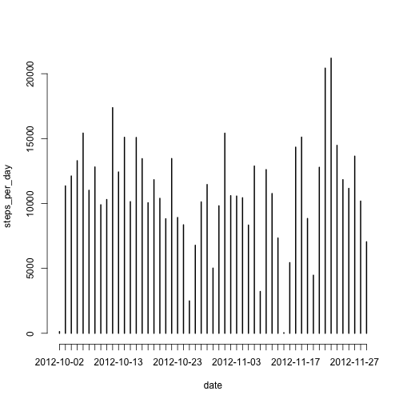
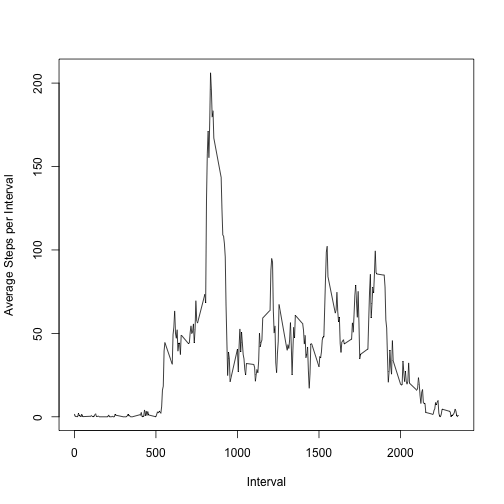
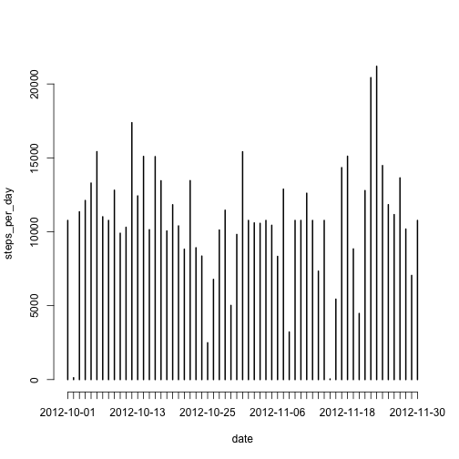
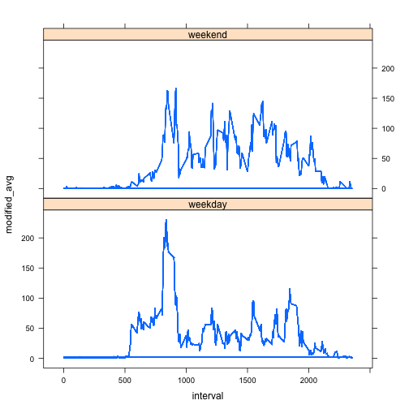

# Reproducible Research: Peer Assessment 1


## Loading and preprocessing the data


```r
activity <- read.csv("activity.csv", na.strings = "NA", colClasses = c("numeric", 
    "Date", "numeric"))
```


## What is mean total number of steps taken per day?


```r
steps_per_day <- xtabs(steps ~ date, data = activity)
meanSPD <- mean(steps_per_day, na.rm = TRUE)
medianSPD <- median(steps_per_day, na.rm = TRUE)
plot(steps_per_day)
```

 

Mean Steps Per Day: 1.0766 &times; 10<sup>4</sup>  
Median Steps Per Day: 1.0765 &times; 10<sup>4</sup>

## What is the average daily activity pattern?

```r
y <- tapply(activity$steps, activity$interval, mean, na.rm = TRUE)
plot(names(y), y, type = "l", xlab = "Interval", ylab = "Average Steps per Interval")
```

 

```r
maxY <- max(y)
maxInterval <- names(y[y == max(y)])
```

The interval with the maximum average steps is: 835  
The average number of steps for that interval is: 206.1698

## Imputing missing values

```r
missing_rows <- sum(is.na(activity$steps))
```

The number of missing rows is: 2304  


```r
## replace NA values in steps with the average for that interval
activity$avg <- y[as.character(activity$interval)]
activity$modified_steps <- ifelse(is.na(activity$steps), activity$avg, activity$steps)

steps_per_day <- xtabs(modified_steps ~ date, data = activity)
meanSPD <- mean(steps_per_day)
medianSPD <- median(steps_per_day)
plot(steps_per_day)
```

 

The Mean Steps Per Day is now: 1.0766 &times; 10<sup>4</sup>  
The Median Steps Per Day is now: 1.0766 &times; 10<sup>4</sup>

Note that these values have changed very little.  The NA values only affected first and last days and had the effect of moving these to the average day.  Therefore, the Mean steps per day was unchanged, and the median changed only very slightly.

## Are there differences in activity patterns between weekdays and weekends?

```r
activity$daytype <- factor(ifelse(weekdays(activity$date) == "Sunday" | weekdays(activity$date) == 
    "Saturday", "weekend", "weekday"))

## Now create a list of the average steps per interval for weekdays and
## weekends
y <- tapply(activity$modified_steps, list(activity$interval, activity$daytype), 
    mean, na.rm = TRUE)

## And stuff this value into modified_avg for every entry
activity$modified_avg <- ifelse(activity$daytype == "weekday", y[as.character(activity$interval), 
    1], y[as.character(activity$interval), 2])


## And generate the plot
library(lattice)
xyplot(modified_avg ~ interval | daytype, activity, type = "l", layout = c(1, 
    2))
```

 

```r

```

